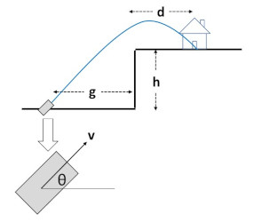
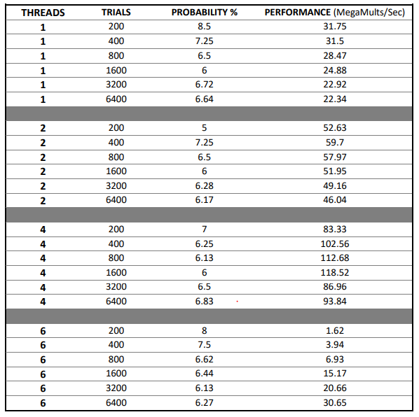
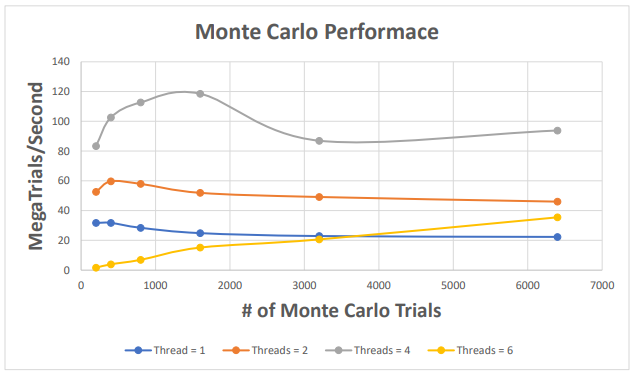
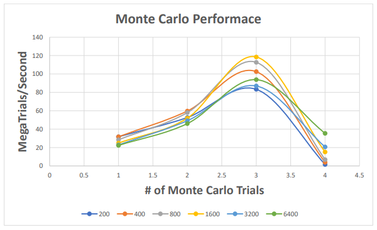

# Monte Carlo simulation
### Monte Carlo simulation is used to determine the range of outcomes for a series of parameters, each of which has a probability distribution showing how likely each option is to happen
----
## Scenario


````
A castle sits on top of a cliff. An amateur band of merceneries is attempting to destroy it. The goal is to figure out the probability that these doofuses will actually hit the castle. This is a job for multicore Monte Carlo simulation!
````

## Data Output from Shell


    - Avg probability across all trails = 6.603%
    - Avg probability (1 – thread) = 6.935%
    - Avg probability (2 – threads) = 6.2%
    - Avg probability (4 – threads) = 6.45%
    - Avg probability (8 – threads) = 6.6%

## Performance Vs. Number of threads


## Performance Vs. Number of trails
